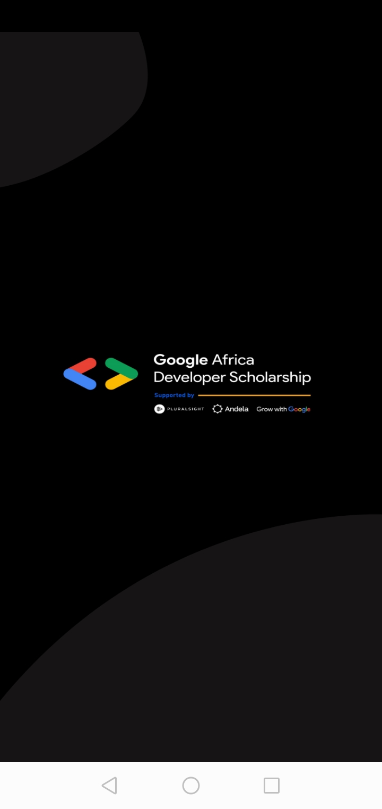
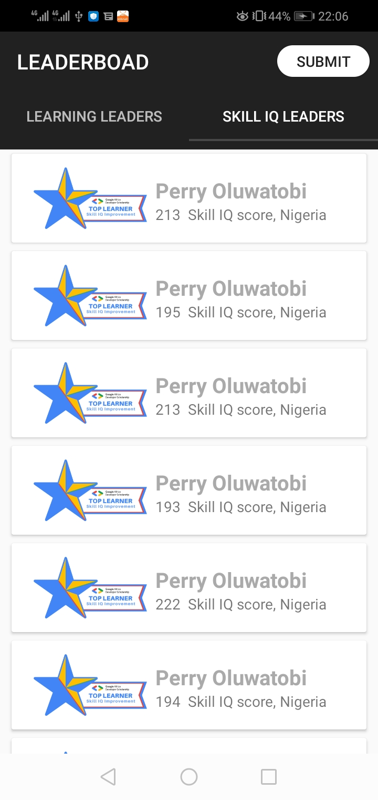
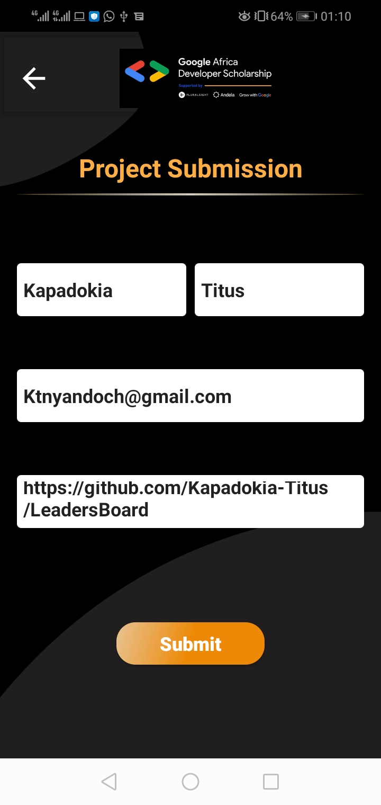
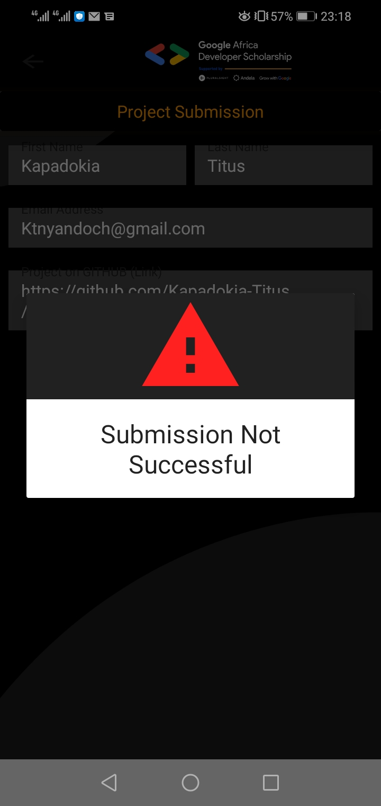

# GADS LeadersBoard application that displays top learners in hours and the skill IQ.
This is a simple application made using MVVM architecture. The app handles GET request and POST submission to a google form.

# Main Dependencies
 Use this dependencies. you can copy them and search to get the latest dependencies:

    {
       implementation 'com.squareup.retrofit2:retrofit:2.8.1' 
       implementation 'com.squareup.retrofit2:converter-gson:2.8.1' 
       implementation 'com.squareup.okhttp3:logging-interceptor:4.5.0' 
       implementation "androidx.lifecycle:lifecycle-viewmodel:2.2.0" 
       implementation "android.arch.lifecycle:runtime:1.1.1" 
       implementation "android.arch.lifecycle:extensions:1.1.1" 
       annotationProcessor "android.arch.lifecycle:compiler:1.1.1" 
       implementation 'com.github.bumptech.glide:glide:4.11.0'
    }

# Discover This App
  The application interface include.  

        
        
         
        
        
        

