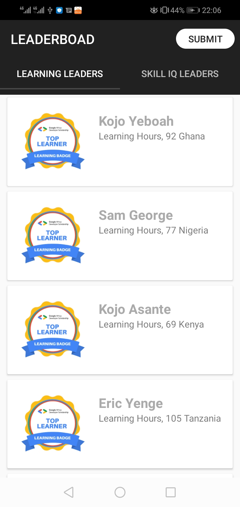

# GADS LeadersBoard application that displays top learners in hours and the skill IQ.
This is a simple application made using MVVM architecture.

# Main Dependencies
{
       implementation 'com.squareup.retrofit2:retrofit:2.8.1'
       implementation 'com.squareup.retrofit2:converter-gson:2.8.1'
       implementation 'com.squareup.okhttp3:logging-interceptor:4.5.0'
       implementation "androidx.lifecycle:lifecycle-viewmodel:2.2.0"
       implementation "android.arch.lifecycle:runtime:1.1.1"
       implementation "android.arch.lifecycle:extensions:1.1.1"
       annotationProcessor "android.arch.lifecycle:compiler:1.1.1"
       implementation 'com.github.bumptech.glide:glide:4.11.0'
}

# Discover This App
The app handles GET request and POST submission to a google form.

